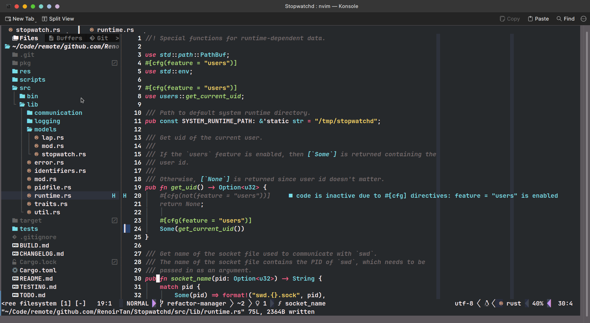

# NeovimSetup

Copy `./init.lua` to `~/.config/nvim/init.lua` and watch the magic happen.

## Plugins

| Plugin | Remarks |
| ------ | ------- |
| [folke/lazy.nvim](https://github.com/folke/lazy.nvim) | Plugin manager. |
| [folke/which-key.nvim](https://github.com/folke/which-key.nvim) | Shows shortcuts. |
| [akinsho/bufferline.nvim](https://github.com/akinsho/bufferline.nvim) | Header at the top for file tabs. |
| [nvim-neo-tree/neo-tree.nvim](https://github.com/nvim-neo-tree/neo-tree.nvim) | File explorer. |
| [neovim/nvim-lspconfig](https://github.com/neovim/nvim-lspconfig) | Integration with language servers. |
| [SmiteshP/nvim-navic](https://github.com/SmiteshP/nvim-navic) | Summaries info from lsp for the status bar. |
| [nvim-lualine/lualine.nvim](https://github.com/nvim-lualine/lualine.nvim) | Status bar. |
| [lewis6991/gitsigns.nvim](https://github.com/lewis6991/gitsigns.nvim) | Git decorations. |
| [lukas-reineke/indent-blankline.nvim](https://github.com/lukas-reineke/indent-blankline.nvim) | Indent guides. |
| [tanvirtin/monokai.nvim](https://github.com/tanvirtin/monokai.nvim) | Monokai theme. |
| [xiyaowong/transparent.nvim](https://github.com/xiyaowong/transparent.nvim) | Sets background transparency. |
| [lambdalisue/suda.vim](https://github.com/lambdalisue/suda.vim) | Sudo write to readonly files. |

## External Software

Some plugins have their own dependencies that you have to install from somewhere. Here is a rundown of those dependencies.

 - A nerd font. I'm using `JetBrains Mono` from [ryanoasis/nerd-fonts](https://github.com/ryanoasis/nerd-fonts).
 - LSPs for `neovim/nvim-lspconfig`. (Might replace this list with a plugin that installs the servers automatically for you in the future.)
   - [pylsp](https://github.com/python-lsp/python-lsp-server).
   - [tsserver](https://github.com/typescript-language-server/typescript-language-server)
   - [rust_analyzer](https://rust-analyzer.github.io/)
   - [ccls](https://github.com/MaskRay/ccls)
 - `sudo` for `lambdalisue/suda.vim`.

## Custom Commands and Shortcuts

| Command/Shortcut | Description |
| ---------------- | ----------- |
| `<A-e>` | Open neo-tree file explorer. |
| `:ToggleTransparency` | Turns transparency on or off. |
| `<C-Space>` | Runs `:ToggleTransparency`. |
| `<C-h>` or `<C-Left>` | Focus on editor to the left. |
| `<C-j>` or `<C-Down>` | Focus on editor below this one. |
| `<C-k>` or `<C-Up>` | Focus on editor above this one. |
| `<C-l>` or `<C-Right>` | Focus on editor to the right. |
| `ts` | Switch to tab. Runs `:BufferLinePick`. | 
| `td` | Close tab. Runs `:BufferLinePickClose`. |
| `gD` | Go to declaration. (LSP) |
| `gd` | Go to definition. (LSP) |
| `gi` | Go to implementation. (LSP) |
| `gr` | Go to references. (LSP) |
| `K` | Hover over variable/function/etc. (LSP) |
| `<space>f` | Format code. (LSP) |
| `<space>wa` | Add workspace folder. (LSP) |
| `<space>wr` | Remove workspace folder. (LSP) |
| `<space>wl` | List workspace folders. (LSP) |
| `<space>D` | Show type definition. (LSP) |
| `<space>rn` | Rename variable/function/etc. (LSP) |
| `<space>ca` | code_action (LSP) |
